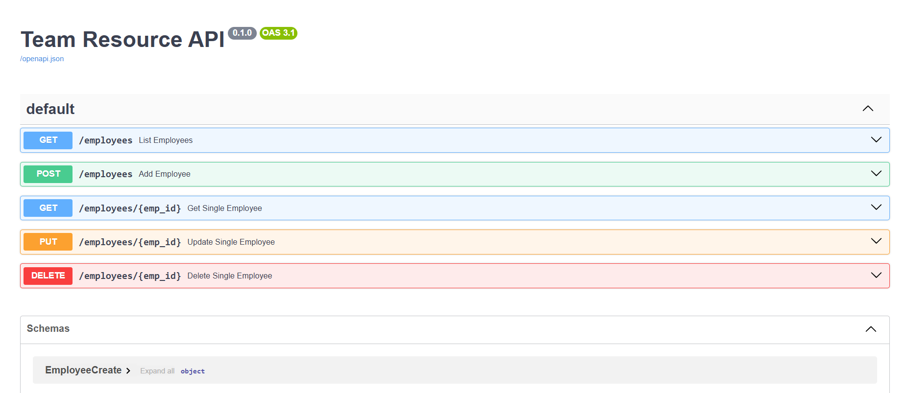

# 📘 Team Resource API (FastAPI + MySQL + AWS RDS)

A production-style **CRUD REST API** built using **FastAPI**, **SQLAlchemy ORM**, and **MySQL (AWS RDS)** to manage employee/team resources.

---

## 🚀 Features

- Create, Read, Update, Delete (CRUD) employees
- Clean layered architecture (routes, schemas, models, CRUD)
- SQLAlchemy ORM (no raw SQL)
- Pydantic validation
- MySQL database hosted on **AWS RDS**
- Swagger UI for API testing
- Ready for frontend integration (CORS supported)

---

## 🧱 Tech Stack

- **Backend**: FastAPI
- **ORM**: SQLAlchemy
- **Validation**: Pydantic
- **Database**: MySQL
- **Cloud Database**: AWS RDS
- **Driver**: PyMySQL

---

## 📂 Project Structure

app/
├── main.py # FastAPI app & routes
├── database.py # DB connection & session
├── models.py # SQLAlchemy ORM models
├── schemas.py # Pydantic schemas
├── crud.py # Database operations
├── init.py
.env
requirements.txt
README.md

## 🔐 Environment Variables

Create a `.env` file in the root directory:

````env
DB_USER=admin
DB_PASSWORD=yourpassword
DB_HOST=your-rds-endpoint.amazonaws.com
DB_PORT=3306
DB_NAME=employee_db


 ## To run fast api
 uvicorn app.main:app --reload

##🧠 Architecture Flow

Client
  ↓
FastAPI Routes
  ↓
Pydantic Schemas (Validation)
  ↓
CRUD Layer
  ↓
SQLAlchemy ORM
  ↓
AWS RDS MySQL


-----------------------------------------------------------------------------------------------------------

# 🗄️ AWS RDS MySQL Setup (Step-by-Step Guide)

This guide explains how to set up a **MySQL database on AWS RDS (Free Tier)** and connect it to your backend application.

---

## 1️⃣ Login to AWS Console
- Go to **AWS Console**
- Navigate to **RDS**
- Click **Create database**

---

## 2️⃣ Database Configuration
- **Creation method:** Standard create
- **Engine type:** MySQL
- **Engine version:** Default (MySQL 8.x)

---

## 3️⃣ Template
- Select **Free tier**

---

## 4️⃣ Settings
- **DB instance identifier:** `employee-db`
- **Master username:** `admin`
- **Master password:**
  - Choose a strong password
  - Save it securely (password manager recommended)

---

## 5️⃣ Instance Configuration
- **DB instance class:** `db.t3.micro`

---

## 6️⃣ Storage
- Keep **default settings**
- **Allocated storage:** 20 GB (sufficient for learning & demos)

---

## 7️⃣ Connectivity (IMPORTANT)
- **Public access:** Yes
- **VPC security group:**
  - Add inbound rule:
    - **Type:** MySQL / Aurora
    - **Port:** 3306
    - **Source:** `0.0.0.0/0`
    ⚠️ *For learning purposes only. Do NOT use this in production.*

---

## 8️⃣ Create Database
- Click **Create database**
- Wait until the status becomes **Available**

---

## 9️⃣ Get RDS Endpoint
- Open the created database
- Go to **Connectivity & security**
- Copy the **Endpoint**

### Example:
```text
employee-db.c9akciqxyz.ap-south-1.rds.amazonaws.com


### Sample Request (POST)
{
  "name": "Rahul",
  "email": "rahul@gmail.com",
  "role": "Developer",
  "skills": "Python, SQL, AWS",
  "availability": "Full-time"
}
````

---

### ✅ What you can do next

- Push this to GitHub
- Add screenshots of Swagger UI
- Use this project in interviews confidently

If you want, I can:

- Write **resume bullet points**
- Add **pagination + search**
- Convert to **routers**
- Add **JWT auth**
- Create **system design explanation**

Just tell me 👍


