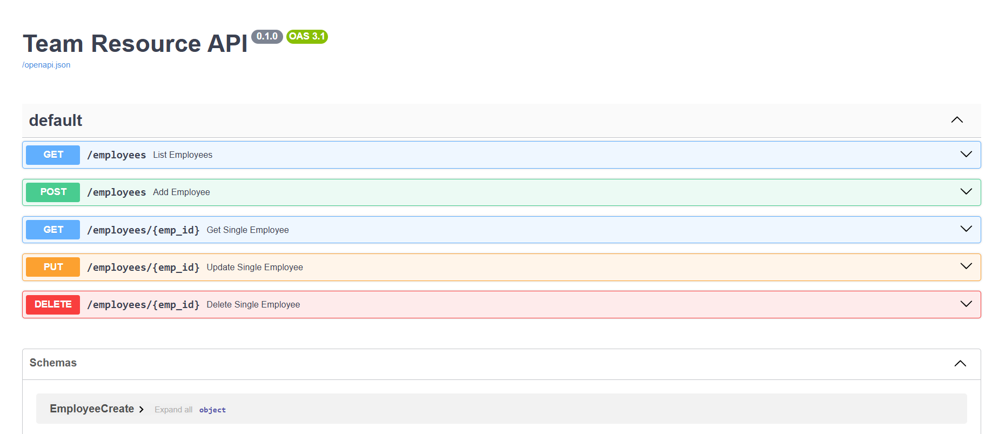

# 📘 Team Resource API (FastAPI + MySQL + AWS RDS)

A production-style **CRUD REST API** built using **FastAPI**, **SQLAlchemy ORM**, and **MySQL (AWS RDS)** to manage employee/team resources.

🔗 **Live API:**
https://simple-crud-one-roan.vercel.app/

📖 **Swagger Documentation:**
https://simple-crud-one-roan.vercel.app/docs

---

# 🚀 Features

- Create, Read, Update, Delete (CRUD) employees
- Clean **layered architecture**
- SQLAlchemy ORM (no raw SQL)
- Pydantic request validation
- MySQL database hosted on **AWS RDS**
- **Serverless deployment using Vercel**
- Interactive API testing with **Swagger UI**
- Ready for frontend integration (CORS supported)

---

# 🧱 Tech Stack

| Layer             | Technology          |
| ----------------- | ------------------- |
| Backend Framework | FastAPI             |
| ORM               | SQLAlchemy          |
| Validation        | Pydantic            |
| Database          | MySQL               |
| Cloud Database    | AWS RDS             |
| Deployment        | Vercel (Serverless) |
| Driver            | PyMySQL             |

---

# ☁️ Deployment (Vercel)

This API is deployed using **Vercel Serverless Functions**, which allows the FastAPI backend to run without managing infrastructure.

When code is pushed to GitHub, **Vercel automatically builds and deploys the API**.

### Deployment Workflow

1. Developer pushes code to GitHub
2. Vercel automatically triggers a build
3. Dependencies are installed
4. FastAPI app is deployed as a **serverless function**
5. API becomes publicly accessible

### Serverless Entrypoint

Vercel detects backend functions inside the `api` folder.

Project deployment entrypoint:

```
api/
└── index.py
```

`api/index.py`

```python
from app.main import app
```

This exposes the FastAPI application to Vercel’s runtime.

### Environment Variables

Database credentials are stored securely in **Vercel Environment Variables**.

Example variables configured:

```
DB_HOST
DB_PORT
DB_USER
DB_PASSWORD
DB_NAME
```

This ensures sensitive data is **not stored inside the repository**.

---

# 📂 Project Structure

```
app/
│
├── main.py        # FastAPI application & routes
├── database.py    # Database connection & session
├── models.py      # SQLAlchemy ORM models
├── schemas.py     # Pydantic schemas
├── crud.py        # Database CRUD operations
├── __init__.py
│
api/
└── index.py       # Vercel serverless entrypoint

.env
requirements.txt
README.md
```

---

# 🔐 Environment Variables

Create a `.env` file in the root directory.

```
DB_USER=admin
DB_PASSWORD=yourpassword
DB_HOST=your-rds-endpoint.amazonaws.com
DB_PORT=3306
DB_NAME=employee_db
```

---

# ▶️ Running the Application Locally

Install dependencies:

```
pip install -r requirements.txt
```

Run the FastAPI server:

```
uvicorn app.main:app --reload
```

Open Swagger documentation:

```
http://127.0.0.1:8000/docs
```

---

# 🧠 Architecture Flow

```
Client / Frontend
        ↓
FastAPI Routes
        ↓
Pydantic Schemas (Validation)
        ↓
CRUD Layer
        ↓
SQLAlchemy ORM
        ↓
AWS RDS MySQL Database
```

---

# 🗄️ AWS RDS MySQL Setup (Step-by-Step Guide)

This guide explains how to set up a **MySQL database on AWS RDS (Free Tier)** and connect it to the backend application.

---

## 1️⃣ Login to AWS Console

Go to **AWS Console → RDS → Create Database**

---

## 2️⃣ Database Configuration

- Creation Method → **Standard Create**
- Engine Type → **MySQL**
- Engine Version → Default (MySQL 8.x)

---

## 3️⃣ Template

Select **Free Tier**

---

## 4️⃣ Settings

```
DB instance identifier: employee-db
Master username: admin
```

Choose a secure password.

---

## 5️⃣ Instance Configuration

```
DB Instance Class: db.t3.micro
```

---

## 6️⃣ Storage

```
Allocated Storage: 20 GB
```

This is enough for learning and demo projects.

---

## 7️⃣ Connectivity (Important)

Enable public access and update the security group:

```
Type: MySQL / Aurora
Port: 3306
Source: 0.0.0.0/0
```

⚠️ For learning purposes only. Restrict access in production.

---

## 8️⃣ Create Database

Click **Create Database** and wait until status becomes:

```
Available
```

---

## 9️⃣ Get RDS Endpoint

Open the database → **Connectivity & Security** → copy the endpoint.

Example:

```
employee-db.c9akciqxyz.ap-south-1.rds.amazonaws.com
```

Use this value as `DB_HOST`.

---

# 📌 Example API Request

### Create Employee

```
POST /employees
```

Request body:

```json
{
  "name": "Rahul",
  "email": "rahul@gmail.com",
  "role": "Developer",
  "skills": "Python, SQL, AWS",
  "availability": "Full-time"
}
```

---

# 📊 Possible Future Improvements

- Pagination and filtering
- JWT authentication
- API versioning
- Docker containerization
- Alembic database migrations
- CI/CD pipeline with GitHub Actions
- Role-based access control

---

# 👨‍💻 Author

Dheeraj
Backend / Data Engineer

---

# ⭐ Support

If you found this project useful, consider giving the repository a **star ⭐ on GitHub**.


